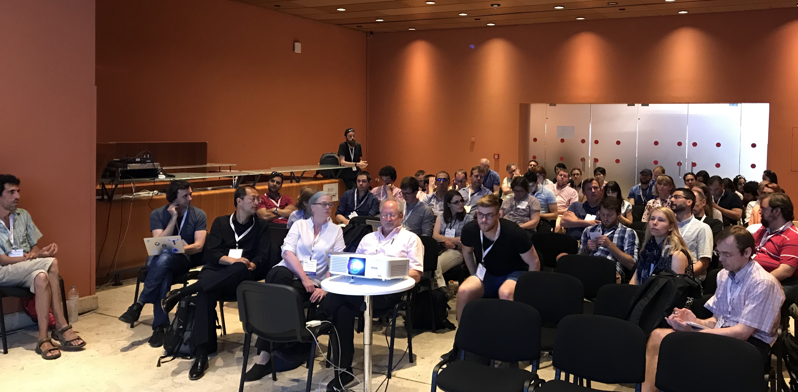

## Join us for the SIG Meeting in Rome

The niQC SIG meeting will be on *Monday (June 10th) at 11.30am in the Open Science Room*. Please refer to OHBM 2019 maps of the venue.

Agenda for the meeting:
 - Meet and greet 
 - Short presentation on niQC goals, progress so far, and future plans
 - Open discussion towards achieving niQC goals

See you all there! And bring your friends.

## Updates from the meeting :

We are delighted to annouce this meeting was very well attended by 70+ members. 

We had an open and wide-ranging discussion covering various important aspects related to the full scope of the niQC SIG. The following action items were finalized, based on initial suggestions from the chair Pradeep Reddy Raamana:

 - Curate the responses from the broad survey and summarize them 
   - to define scope broadly and deeply
 - Forming sub-groups per each modality or analysis!
   - Draft guidelines, and perhaps a template for high-level protocol?
 - Running periodic webinars for tutorials, latest advances and open panel discussions
 - Define terminology
   - Reuse or rely on COBIDAS
   - What is even a “protocol”?
 - Define and refine “image quality metrics” (IQMs)
 - Get everyone to share datasets and ground truth ratings

The slides presented can be downloaded [here](./Raamana_niQC_SIG_Meeting_OHBM19_Rome.pdf).
