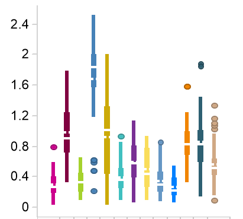

Various datasets related to niQC research will be linked here, such as ratings of public datasets, phantom images and examples for various artefacts in different modalities. These datasets would be useful for various applications, including but not limited to
 - developing automatic detection techniques of artefacts and "bad scans"
 - developing image quality metrics and improving them based on public QC ratings
 - developing phantom QA protocols and harmonization across different scanners

If you are aware of a public dataset relevant to niQC, [**please send a pull request (PR) with the details**](https://github.com/INCF/niQC/pull/new/master), or [open an issue](https://github.com/INCF/niQC/issues/new) at the [niQC repo](https://github.com/INCF/niQC). *Thank you for your contribution*.

## Long-term, Phantom Quality Assurance (QA) data for functional MRI from 13 3T research scanners from Ontario Brain Institute (OBI)

Function Biomedical Informatics Research Network (fBIRN) phantoms were scanned at monthly intervals for *four* years as a quality assurance (QA) measure to monitor between- and within-site stability in 13 magnetic resonance imaging (MRI) scanners participating in the multisite, longitudinal studies of the [Ontario Brain Institute’s (OBI)](https://www.braininstitute.ca) programs: [Ontario Neurodegeneration Disease Research Initiative (ONDRI)](https://www.ondri.ca) and [Canadian Biomarker Integration Network in Depression (CAN-BIND)](https://www.canbind.ca). Acquisitions were performed using the resting state functional MRI (rs-fMRI) sequence of the [Canadian Dementia Imaging Protocol (CDIP)](https://www.cdip-pcid.ca). 

This open data release includes DICOM images from 629 rs-fMRI scans acquired from five General Electric (GE), two Philips, and six Siemens 3T scanners (mean number of scans per scanner = 48.5), as well as QA summary results for each scan as derived from the fBIRN pipeline. Apply for access on [BrainCODE](https://www.braincode.ca/content/open-data-releases).

